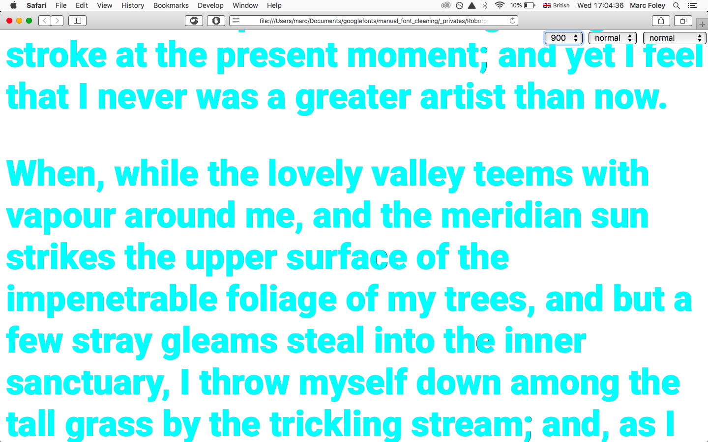

# [v2.138 unhinted offical](https://github.com/google/roboto/releases/tag/v2.138) vs VF

Regression tests to determine whether the variable font match the previous unhinted v2.138 release.


## Building ttfs

master_ttf/ built with [fontmake v1.6.0](https://github.com/googlei18n/fontmake/releases/tag/v1.6.0) using the following cli:

```
sh build-min.sh
```

## Viewing diffs

Diffs produced by using Python's HTTPSimple server on this repo and viewing vf_vs_v2_138.html in Browserstack.

The html file contains every glyph in the font on a single line. Our goal is to ensure that both fonts overlay perfectly. The diff images show the very end of the line.

Three further html test files are provided:

1. master_ttf_vs_v2_138.html
2. master_ttf_interpolatable_vs_2_138.html
3. vf_vs_2_138_real_world.html


### Starting Python's simple server to view test pages in browserstack

```

cd ./to/this/repo
python -m SimpleHTTPServer
# Enabling browserstack local testing https://www.browserstack.com/local-testing
# view local site in browserstack
```

## Summary for commit e7ece644e5714951089cd6916db07fc055c9383d
- Each OS and Browser produced a different result


## Diff Notes

Following summary has been made by M Foley by reviewing each diff image

- Masters in the VF produced a closer match (images with 200 in filename)
- Overall Chrome produced the closest match
- Chrome's results across each platform seem almost identical
- Glyphs which are assembled from components are affected the most

It's interesting to note that each platform will produce different results. This means it's not just the fonts which determine the end result. Rasterizers and shaping engines such as CoreText play a critical role as well. Due to this, it's probably impossible to get a 100% match.

The metrics may also differ between platforms because some browsers may not use the [hvar](https://docs.microsoft.com/en-us/typography/opentype/spec/hvar) table and others will (not tested, just a thought).

The master_ttf_interpolatable fonts which were used to construct the VF match perfectly in Chrome. This is the same for the master_ttf fonts.

This test is extreme since we're testing all glyphs without a single line break. If we compare typical samples of text, The results are much better.



